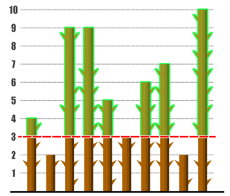

#Studi Kasus C : Tebas Tebang Pohon

## Deskripsi Cerita

Di belakang rumah Pak Dengklek terdapat N buah pohon yang mana pohon ke-i memiliki ketinggian sebesar Ai. Pak Dengklek berencana untuk menebang pohon-pohon tersebut untuk membangun sebuah kandang untuk bebek-bebeknya.

Cara menebang Pak Dengklek cukup unik yakni sebagai berikut. Pak Dengklek pertama-tama akan menentukan sebuah **bilangan bulat non-negatif** X yang disebut sebagai **batas ketinggian maksimum**. Kemudian, Pak Dengklek akan menebang bagian atas seluruh pohon yang memiliki tinggi lebih dari X sehingga pohon tersebut pada akhirnya memiliki ketinggian tepat X. Sehingga, apabila sebuah pohon dengan ketinggian Y ditebang karena Y > X, maka Pak Dengklek akan mendapatkan sebuah potongan pohon dengan panjang Y–X dari pohon tersebut.

Berikut adalah ilustrasi penebangan Pak Dengklek jika terdapat 10 buah pohon dengan ketinggian masing-masing sebesar 4, 2, 9, 9, 5, 3, 6, 7, 2, 10; dengan batas ketinggian maksimum sebesar 3.

Seluruh potongan pohon yang ditebang akan disatukan dan dijumlahkan panjangnya. Agar Pak Dengklek dapat membangun kandang, Pak Dengklek membutuhkan jumlah panjang potongan pohon yang ditebang yakni **setidaknya** sebesar M. Karena Pak Dengklek ingin pohon-pohon di belakang rumahnya tetap menjulang tinggi, Pak Dengklek akan memilih batas ketinggian maksimum yang paling tinggi selama ia dapat membangun kandang untuk bebek-bebeknya. Bantulah Pak Dengklek!

## Soal Pemahaman

### Soal C1

Asumsikan terdapat 20 pohon dengan ketinggian sebesar 1, 2, 3, dan seterusnya hingga 20. Apabila Pak Dengklek menebang dengan batas ketinggian maksimum sebesar 7, maka berapa jumlah panjang potongan pohon yang ditebang oleh Pak Dengklek?

**Tuliskan jawaban dalam bentuk ANGKA.**

### Soal C2

<ins>**BENAR** atau **SALAH**</ins>: Untuk setiap kemungkinan pohon-pohon di belakang rumah Pak Dengklek, apabila Pak Dengklek dapat membangun sebuah kandang jika ia menebang dengan batas ketinggian maksimum sebesar Z dengan Z > 0, maka Pak Dengklek juga pasti dapat membangun sebuah kandang jika ia menebang dengan batas ketinggian maksimum sebesar Z – 1.

### Soal C3

Asumsikan terdapat 10 pohon dengan ketinggian sebesar 10, 20, 30, dan seterusnya hingga 100. Apabila Pak Dengklek membutuhkan minimal jumlah panjang potongan pohon yang ditebang sebesar 111, berapakah batas ketinggian maksimum yang paling tinggi yang dapat dipilih oleh Pak Dengklek?

**Tuliskan jawaban dalam bentuk ANGKA.**

## Soal Pemrograman

Tulislah sebuah program dengan bahasa C/C++ sesuai deskripsi cerita dengan format dan batasan sebagai berikut. Perhatikan bahwa untuk setiap kasus uji berlaku ***time limit*** selama 2 detik dan ***memory limit*** sebanyak 256 MB.

### Format Masukan

Masukan diberikan dalam format berikut:

<pre>
N M
A1 A2 ... AN
</pre>

### Format Keluaran

Keluarkan sebuah baris berisi sebuah bilangan bulat yang menyatakan batas ketinggian maksimum yang paling tinggi yang dapat dipilih oleh Pak Dengklek sehingga ia tetap dapat membangun sebuah kandang untuk bebek-bebeknya. Jika Pak Dengklek tidak mungkin dapat membangun sebuah kandang untuk bebek-bebeknya berapa pun batas ketinggian maksimum yang ia pilih, keluarkan -1.

### Contoh Masukan dan Keluaran

| Contoh Masukan                   | Contoh Keluaran |
|----------------------------------|-----------------|
| 10 25   4 2 9 9 5 3 6 7 2 10 | 3               |
| 5 5   2 7 2 9 5              | 5               |
| 5 25   2 7 2 9 5             | 0               |
| 5 125   2 7 2 9 5            | -1              |

### Penjelasan Contoh

Pada contoh pertama, penebangan pohon Pak Dengklek dapat disimak kembali pada ilustrasi pada deskripsi cerita. Jumlah panjang potongan adalah 1 + 6 + 6 + 2 + 3 + 4 + 7 = 29 sehingga cukup bagi Pak Dengklek untuk membangun kandang.

Pada contoh kedua, Pak Dengklek dapat memilih batas ketinggian maksimum sebesar 5, sehingga ia akan menebang pohon ke-2 dan mendapatkan sebuah potongan sepanjang 7 – 5 = 2 serta menebang pohon ke- 4 dan mendapatkan sebuah potongan sepanjang 9 – 5 = 4. Jumlah panjang potongan adalah 2 + 4 = 6 sehingga cukup bagi Pak Dengklek untuk membangun kandang.

Pada contoh ketiga, perhatikan bahwa Pak Dengklek bisa saja memilih batas ketinggian maksimum sebesar 0, yang artinya Pak Dengklek akan menebang habis seluruh pohon untuk membangun kandang.

Pada contoh keempat, bagaimana pun Pak Dengklek menebang pohon - pohon di belakang rumahnya, ia tetap tidak dapat membangun sebuah kandang untuk bebek-bebeknya.

### Batasan

Untuk seluruh kasus uji berlaku:

* 1 ≤ N ≤ 100 000
* 1 ≤ M ≤ 1012
* 1 ≤ Ai ≤ 1 000 000

### Batasan Tambahan untuk Subsoal 1(Mudah)

Pada subsoal ini, untuk seluruh kasus uji berlaku:

* N ≤ 1000
* Ai ≤ 1000

### Batasan Tambahan untuk Subsoal 2(Sulit)

Tidak ada batasan tambahan pada subsoal ini.

### Peringatan

Untuk dapat menjawab pertanyaan ini dengan benar, Anda mungkin perlu menggunakan tipe data **long long** untuk dapat menyimpan data dengan nilai yang besar. Tipe data **int** saja mungkin tidak cukup!
