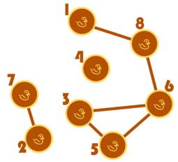

# Studi Kasus E: Gosip Gulali

## Deskripsi Cerita

Pak Dengklek memiliki N ekor bebek penggemar gulali, yang dinomori dari 1 hingga N. Untuk liburan  akhir tahun ini, Pak Dengklek ingin memberi hadiah kepada mereka berupa gulali. Terdapat M jenis gulali yang dapat dibeli oleh Pak Dengklek, dinomori dari 1 hingga M. Jenis gulali ke-i memiliki tingkat kemanisan sebesar Gi. Perhatikan bahwa Pak Dengklek boleh membeli sebuah jenis gulali yang sama beberapa kali, atau dengan kata lain, setiap jenis gulali memiliki stok gulali yang tidak terbatas.

Setiap bebek Pak Dengklek memiliki tingkat kemanisan favoritnya masing-masing. Bebek ke-i memiliki tingkat kemanisan favorit sebesar Bi. Idealnya, mereka ingin mendapatkan gulali dengan tingkat kemanisan yang tepat sama dengan tingkat kemanisan favorit mereka. Namun, mereka akan tetap menerima gulali dengan tingkat kemanisan berapa pun juga, meskipun mungkin akan timbul rasa ketidakpuasan. Apabila seekor bebek memiliki tingkat kemanisan favorit X dan ia mendapatkan gulali dengan tingkat kemanisan Y, maka **rasa ketidakpuasan** bebek tersebut dapat dinyatakan sebagai **selisih** dari X dan Y.

Lebih lanjut, ternyata para bebek suka bergosip dengan teman-temannya. Seekor bebek mungkin bergosip dengan nol atau lebih bebek lain. Diketahui bahwa terdapat K buah hubungan gosip. Setiap hubungan gosip dinyatakan sebagai dua buah bilangan bulat **berbeda** Pi dan Qi yang artinya bebek ke-Pi dan bebek ke-Qi saling bergosip satu sama lain.

Apabila bebek ke-A bergosip dengan bebek ke-B, maka bebek ke-A pasti akan tahu jenis gulali yang diterima oleh bebek ke-B, dan sebaliknya. Apabila bebek ke-A bergosip dengan bebek ke-B, dan bebek ke-B juga bergosip dengan bebek ke-C, maka bebek ke-A juga akan mulai bergosip dengan bebek ke-C. Alhasil, bebek ke-A juga pasti akan tahu jenis gulali yang diterima oleh bebek ke-C, dan juga sebaliknya.

Agar mencegah terjadinya rasa iri antar para bebek, Pak Dengklek akan menjamin bahwa jika bebek keA mengetahui jenis gulali yang diterima oleh bebek ke-B, maka bebek ke-A **harus** mendapatkan gulali dengan jenis yang **sama** dengan bebek ke-B. Jika dua bebek tidak saling mengetahui jenis gulali yang diterima oleh bebek yang lain, maka kedua bebek boleh saja mendapatkan gulali yang sama atau pun berbeda jenis.

Tentunya, Pak Dengklek ingin membuat seluruh bebek-bebeknya sesenang mungkin, sehingga ia ingin mencari cara untuk memberikan gulali ke semua bebek-bebeknya sedemikian sehingga total rasa ketidakpuasan dari semua bebek-bebeknya sekecil mungkin. Bantulah Pak Dengklek!

## Soal Pemahaman

### Soal E1

Asumsikan bahwa bebek-bebek Pak Dengklek tidak saling bergosip satu sama lain. Misalkan terdapat 5 ekor bebek dengan tingkat kemanisan favorit masing-masing adalah 10, 20, 30, 40, dan 50; dan ada 15 jenis gulali dengan tingkat kemanisan masing-masing sebesar 3, 6, 9, dan seterusnya hingga 45. Berapa total rasa ketidakpuasan terkecil yang dapat diperoleh oleh bebek-bebek Pak Dengklek?

**Tuliskan jawaban dalam bentuk ANGKA.**

### Soal E2

Asumsikan ada 4 ekor bebek bernama Kwak, Kwik, Kwuk dan Kwok. Tingkat kemanisan favorit mereka secara berturut-turut adalah 8, 6, 1, dan 3. Diketahui bahwa pasangan Kwak-Kwok dan Kwuk-Kwok saling bergosip satu sama lain. Jika ada 3 jenis gulali dengan tingkat kemanisan secara berturut-turut sebesar 4, 2, dan 9; berapa total rasa ketidakpuasan terkecil yang dapat diperoleh oleh mereka?

**Tuliskan jawaban dalam bentuk ANGKA.**

### Soal E3

<ins>**BENAR** atau **SALAH**</ins>: Asumsikan untuk seluruh bilangan bulat positif X, selalu terdapat jenis gulali dengan tingkat kemanisan sebesar X pula. Apabila terdapat 3 ekor bebek yang harus mendapatkan gulali dengan jenis yang sama, maka **pasti** optimal untuk memberi mereka jenis gulali dengan tingkat kemanisan yang sedekat mungkin dengan nilai **rata-rata** tingkat kemanisan favorit mereka bertiga.

## Soal Pemrograman

Tulislah sebuah program dengan bahasa C/C++ sesuai deskripsi cerita dengan format dan batasan sebagai berikut. Perhatikan bahwa untuk setiap kasus uji berlaku ***time limit*** selama 3 detik dan ***memory limit*** sebanyak 256 MB.

## Format Masukan

Masukan diberikan dalam format berikut:

<pre>
N M K
B1 B2 ... BN
G1 G2 ... GM
P1 Q1
P2 Q2
...
PK QK
</pre>

## Format Keluaran

Keluarkan sebuah baris berisi sebuah bilangan bulat yang menyatakan total rasa ketidakpuasan terkecil yang dapat diperoleh oleh bebek-bebek Pak Dengklek.

## Contoh Masukan dan Keluaran

| Contoh Masukan                                                                                     | Contoh Keluaran |
|----------------------------------------------------------------------------------------------------|-----------------|
| 8 4 6  10 20 30 40 50 60 70 80 30 40 50 60 1 8 2 7 3 5 3 6 5 6 6 8 | 150             |
| 4 3 0 1 2 13 14 20 10 20                                                                   | 24              |

## Penjelasan Contoh

Pada contoh pertama, hubungan-hubungan gosip dapat diilustrasikan sebagai berikut.

Salah satu cara Pak Dengklek meminimalkan total rasa ketidakpuasan yakni dengan memberi gulali dengan tingkat kemanisan 50 kepada bebek ke-1, ke-3, ke-5, ke-6, dan ke-8; 30 kepada grup bebek ke2 dan ke-7, serta 40 kepada bebek ke-4. Dapat dihitung bahwa total rasa ketidakpuasan adalah 150.

Pada contoh kedua, meskipun keempat bebek boleh mendapatkan gulali yang berbeda-beda jenis, Pak Dengklek dapat memberi keempatnya gulali dengan tingkat kemanisan 10 untuk meminimalkan total rasa ketidakpuasan, yaitu sebesar |1 – 10| + |2 – 10| + |13 – 10| + |14 – 10| = 24.

## Batasan

Untuk seluruh kasus uji berlaku:
* 2 ≤ N, M ≤ 100 000
* 0 ≤ K ≤ 100 000
* 1 ≤ Bi, Gi ≤ 109
* 1 ≤ Pi < Qi ≤ N dan pasangan-pasangan (Pi, Qi) saling berbeda satu sama lain

## Batasan Tambahan untuk Subsoal 1 (Mudah)

Pada subsoal ini, untuk seluruh kasus uji berlaku:
* M ≤ 10
* |Y| ≤ 6

## Batasan Tambahan untuk Subsoal 2 (Sulit)

Tidak ada batasan tambahan pada subsoal ini.

## Peringatan

Untuk dapat menjawab pertanyaan ini dengan benar, Anda mungkin perlu menggunakan tipe data **long long** untuk dapat menyimpan data dengan nilai yang besar. Tipe data **int** saja mungkin tidak cukup!